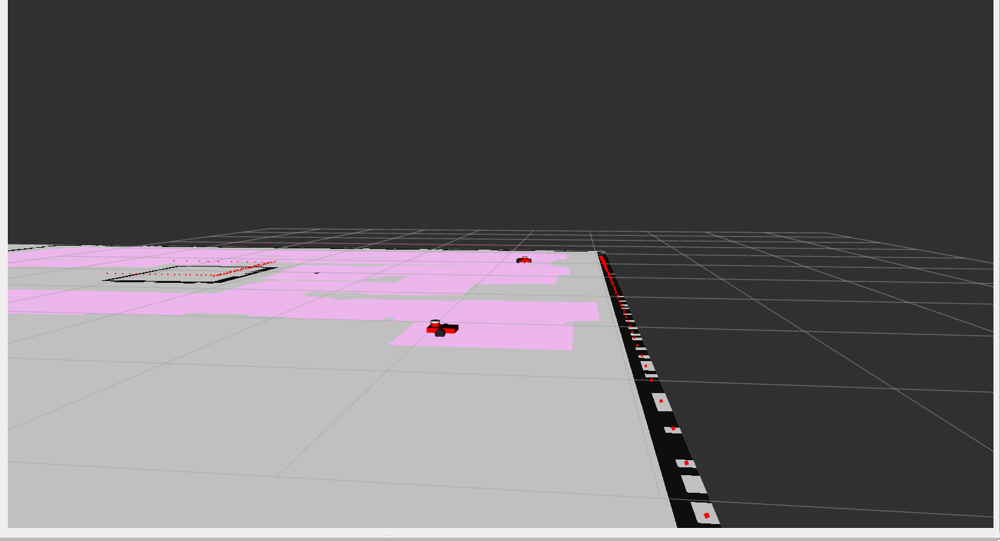
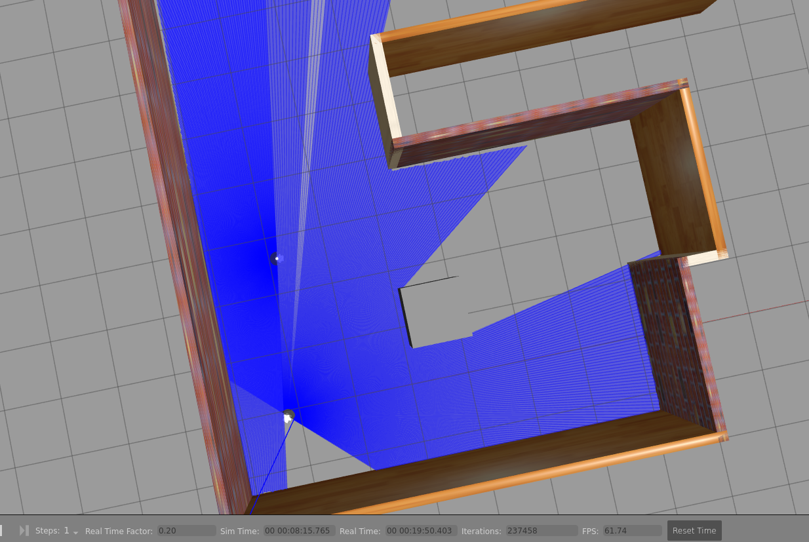

# Intelligent Multi-Robot Coverage System using ROS 2 Nav2

## Autonomous Coverage, Intelligent Task Dispatching, and Scalable Multi-Robot Navigation

---

##  Project Overview

This project implements an **intelligent multi-robot coverage system** using **ROS 2 Humble**, **Nav2**, and **AMCL**, where multiple mobile robots collaboratively explore and cover an environment **without predefined paths or manual waypoint assignment**.

Unlike basic random exploration or waypoint-based systems, this solution introduces:

- A **shared global coverage grid**
- **BFS-based nearest frontier selection**
- **Collision-safe goal validation**
- **Dynamic task reservation between robots**
- **Failure handling and blacklisting**
- **Fully decentralized robot navigation using Nav2**

The system is designed to be **industry-ready**, scalable, and directly applicable to **warehouse robotics, cleaning robots, inspection fleets, and autonomous mobile robots (AMRs)**.

---

## Key Objectives

- Enable **multiple robots** to cover an environment efficiently
- Prevent **duplicate work** across robots
- Handle **navigation failures dynamically**
- Use **standard ROS 2 + Nav2 architecture**
- Maintain a **modular, extensible, and production-oriented design**

---

## System Architecture (High-Level)

The system is composed of **three logical layers**:

---

###  Navigation Layer (Per Robot – Nav2 Stack)

Each robot runs its own independent Nav2 stack:

- AMCL localization
- Global and local costmaps
- Planner server
- Controller server
- Behavior Tree navigator

Each robot navigates autonomously and receives goals from the dispatcher.

---

###  Coverage Grid Layer (Shared Knowledge)

A dedicated **Coverage Grid Server** maintains a global view of visited areas:

- Initializes from the static `/map`
- Subscribes to `/robotX/amcl_pose`
- Converts robot positions into grid coordinates
- Paints visited cells using a configurable brush radius
- Publishes `/coverage_grid` as an `OccupancyGrid`

This grid represents **coverage progress**, not obstacles.

---

###  Dispatcher Layer (Intelligence Core)

The **Dispatcher Node**:

- Reads `/coverage_grid` and `/map`
- Tracks robot positions via AMCL
- Assigns new goals intelligently
- Prevents robots from selecting the same targets
- Handles failures and unsafe goals

---

##  Coverage Grid Server – How Coverage Is Tracked

The coverage grid server:

- Subscribes to `/map` (latched, reliable QoS)
- Subscribes to `/robot1/amcl_pose` and `/robot2/amcl_pose`
- Converts robot world poses into grid indices
- Marks surrounding cells as visited (painted)
- Publishes `/coverage_grid` periodically

### Why a Separate Coverage Grid?

Nav2 costmaps are **local and transient**.  
This grid is:

- Global
- Persistent
- Shared between robots
- Used exclusively for coverage intelligence

---

##  Dispatcher Logic – Core Intelligence

### 🔹 Goal Selection Strategy: Nearest Unvisited Frontier (BFS)

The dispatcher uses **Breadth-First Search (BFS)** on the coverage grid to find the closest unvisited cell.

#### Why BFS?
- Expands outward from the robot’s current location
- Finds the nearest unvisited area efficiently
- Avoids random wandering
- Computationally simple and robust

This approach produces **intentional, efficient, and realistic robot behavior**.

---

##  Pose → Grid → Pose Conversion

1. Robot pose arrives in world coordinates `(x, y)`
2. Converted to grid index for BFS traversal
3. BFS selects an unvisited grid cell
4. Grid index converted back to world pose
5. Goal sent to Nav2 as `PoseStamped`

This keeps:
- Navigation continuous
- Coverage discrete
- Computation efficient

---

##  Multi-Robot Conflict Avoidance

To prevent robots from interfering with each other:

###  Goal Reservation
- When a robot is assigned a goal, the grid index is **reserved**
- Other robots skip reserved indices

###  Failure Tracking
- Goals that fail repeatedly are **blacklisted**
- Blacklisted cells are never reassigned

This mimics **real fleet-level coordination** used in industry systems.

---

##  Safety Validation

Before assigning a goal, the dispatcher verifies:

- Cell is unvisited in coverage grid
- Cell is free in static map
- Cell is not reserved
- Cell is not blacklisted
- A configurable **buffer radius** around the goal is obstacle-free

This prevents deadlocks, wall collisions, and planner oscillations.

---

##  Concurrency & Reliability

The system uses:

- `MultiThreadedExecutor`
- `ReentrantCallbackGroup`
- Thread-safe shared state with `RLock`

This ensures:
- BFS does not block callbacks
- Timers and subscriptions run concurrently
- Map and pose updates remain responsive

---

##  Design Evolution & Engineering Decisions

### Initial Approach
- Random unvisited goal selection
- Resulted in inefficient coverage and robot clustering

### Final Approach
- BFS-based nearest frontier strategy
- Reservation and blacklist system
- AMCL-based localization (not odometry)

**Outcome:** Faster coverage, natural map splitting, and stable behavior.

---

##  Mission Completion Logic

The dispatcher continuously computes:

Once coverage reaches **≥ 98%**:
- Robots stop receiving goals
- Dispatcher shuts down
- Mission is marked complete

---

## Visual Demonstration

### Multi-Robot Coverage in RViz and Painting

### Gazebo Simulation Environment

## How to Run

### Build Workspace

colcon build
source install/setup.bash

    Launch Simulation + Nav2
ros2 launch mobile_bot_bringup main_simulation.launch.py (THIS WILL LAUNCH GAZEBO WORLD WITH ROBOTS AND NAV2 SETUP)

    Launch Rviz to see the setup
rviz2 -d ~/mobile_bot_ws/src/mobile2_bot_description/config/multi2_robot.rviz 

    Start Coverage Grid Server
ros2 run mobile2_bot_coverage coverage_grid_server

    Start Dispatcher
ros2 run mobile2_bot_coverage coverage_dispatcher

## Repository Structure

mobile_bot_ws/
├── src/
│   ├── mobile_bot_description/
│   ├── mobile2_bot_coverage/
│   │   ├── coverage_dispatcher.py
│   │   ├── coverage_grid_server.py
│   │   └── sca_stamper.py (optional showcase node)
│   └── bringup/
├── README.md
├── .gitignore

---

## Industry Relevance

This project demonstrates:

- ROS 2 system architecture

- Nav2 internals understanding

- Multi-robot coordination

- BFS / frontier-based planning

- Thread-safe real-time systems

- Fleet-level task allocation

Applicable to:

- Warehouse AMRs

- Cleaning robots

- Inspection robots

- Security patrol systems

Future Extensions

- AI-based failure prediction

- Coverage efficiency optimization

- Heatmap-driven learning

- Dynamic robot fleet scaling

- Health monitoring integration

## Author

Anurag Pandey
Robotics Engineer